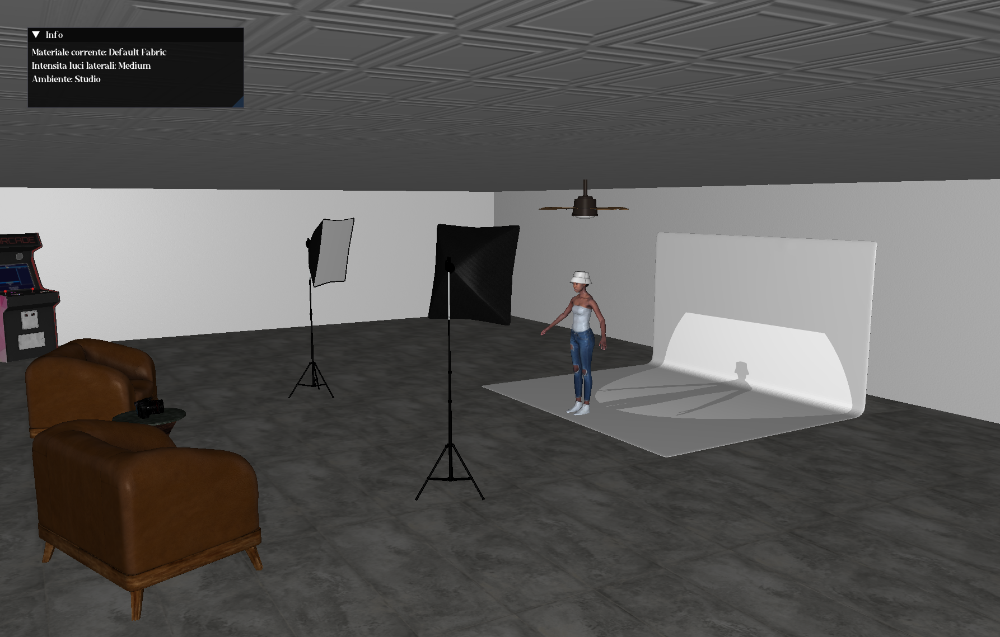

# Graphics Programming Project

This project is based on the techniques described in the **LearnOpenGL** book, focusing primarily on testing and showcasing **normal mapping** on 3D models and various texture types.

The project uses **OBJ models** along with their respective **MTL files** to simplify the linking and application of textures.

---

## Features

- Navigate the scene using **WASD** keys for movement.
- Zoom in and out with the **mouse wheel**.
- Press **M** to cycle through different **T-shirt textures** applied to the 3D character model.
- Press **L** to adjust the **lighting intensity**, cycling through four preset levels: **Off**, **Low**, **Medium**, and **High**.

---

## Usage

Run the program and use the controls described above to explore the effects of normal maps and texture variations on the 3D model.

---

## Project Setup

The Visual Studio project is already configured with relative paths for includes and libraries, so all necessary dependencies are included within the project folders.  
This makes it easy to open and build the project without additional setup or configuration.

---

## Textures

All the textures used in this project can be found [here](Progetto/x64/Debug/tex)

---

## Authors

This project was developed by **Michele Cipriani** and **Tommaso Vilotto**.

---

## Course

The project was created for the **Graphics Programming** course at the University of Verona (UniVR), edition 2024-2025.

---

## Visual Preview

